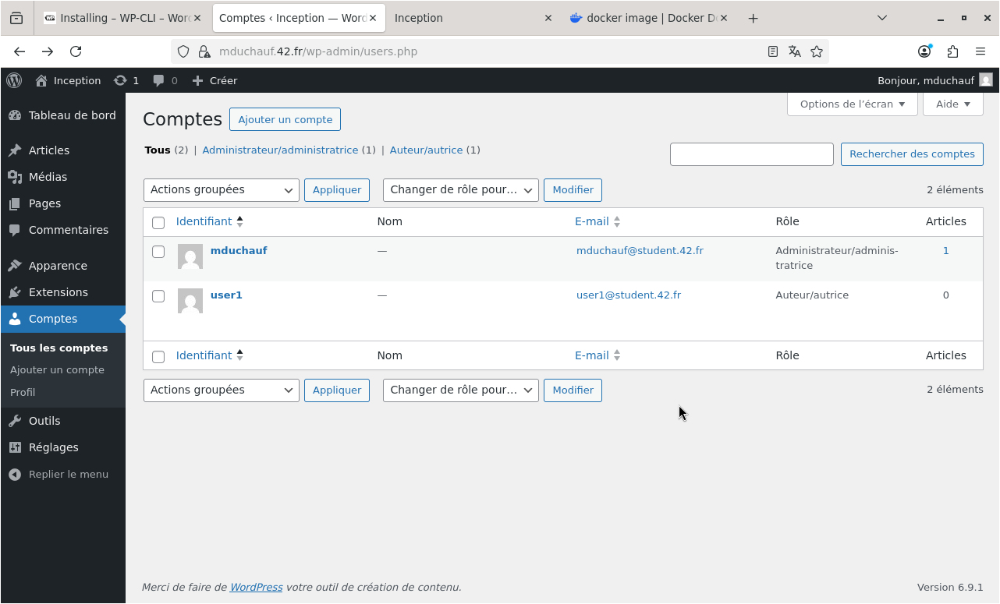
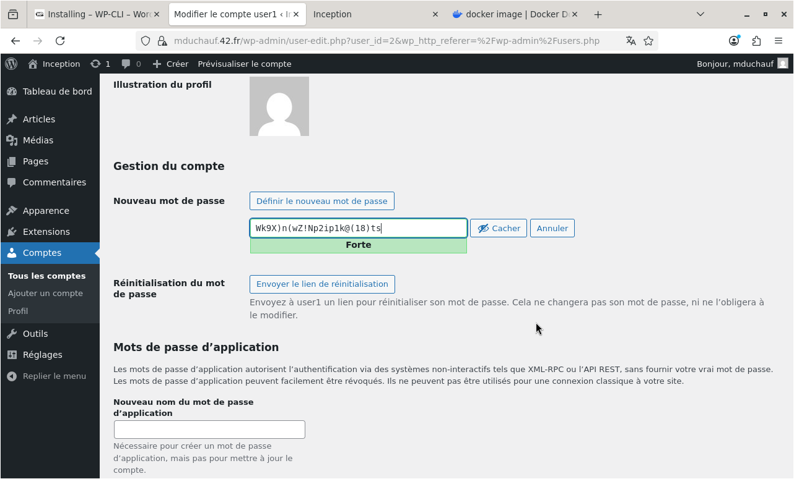

# USER Documentation

## Table of contents

- [Services](#services)
  - [Provided services](#provided-services)
  - [Running services checks](#running-services-checks)
- [Start and stop the project](#start-and-stop-the-project)
- [Access the website and administration panel](#access-the-website-and-administration-panel)
- [Manage credentials and settings](#manage-credentials-and-settings)

---

## Services

### Provided services

This stack is composed of **3 containers**, each with a specific role:

1. **Nginx (TLSv1.3 only)**
   - Public entrypoint of the infrastructure.
   - Accepts HTTPS requests and handles TLS termination.
   - Proxies PHP requests to the WordPress/PHP-FPM container.
   - **Exposed port:** `443` (host -> container).
   - **Important:** in mandatory mode, this is the **only exposed port**.

2. **WordPress + PHP-FPM (without Nginx)**
   - Runs WordPress application files.
   - Executes PHP scripts through PHP-FPM.
   - Receives traffic only from Nginx via the Docker network.
   - **Internal port:** `9000` (not exposed to host).

3. **MariaDB (without Nginx)**
   - Stores persistent WordPress data (users, posts, settings, etc.).
   - Accessible only from WordPress through the Docker network.
   - **Internal port:** `3306` (not exposed to host).

**Summary:** only `Nginx:443` is reachable from outside.
`WordPress:9000` and `MariaDB:3306` remain internal.

### Running services checks

List containers:

```bash
docker ps -a
```

Show global Docker information (images, containers, volumes, disk usage):

```bash
make infos
```

Show volume mountpoints:

```bash
make inspect-vlm
```

---

## Start and stop the project

Build and start the full stack:

```bash
make
```

Then open:

```text
https://<your_login>.42.fr
```

Stop containers without deleting images/volumes:

```bash
make down
```

Stop and remove containers, images, and volumes:

```bash
make fclean
```

Full cleanup (including Docker build cache):

```bash
make full-clean
```

Rebuild from scratch and restart:

```bash
make re
```

---

## Access the website and administration panel

WordPress login page:

```text
https://<your_login>.42.fr/wp-login.php
```

WordPress admin panel:

```text
https://<your_login>.42.fr/wp-admin
```


<!--  -->

---

## Manage credentials and settings

### Where credentials are stored

- Secrets are stored in local files under:
  - `secrets/`
- Wordpress title and domain name are stored in `./srcs/.env`

### What can be managed from WordPress admin

<div style="display:flex; gap:16px; flex-wrap:wrap; align-items:flex-start;">

  <figure style="margin:0;">
    
    <figcaption>Users and roles</figcaption>
  </figure>

  <figure style="margin:0;">
    
    <figcaption>Passwords</figcaption>
  </figure>

  <figure style="margin:0;">
    
    <figcaption>Website title and general settings</figcaption>
  </figure>

</div>

<!-- - Users and roles


- Passwords


- Website title and general settings

 -->
